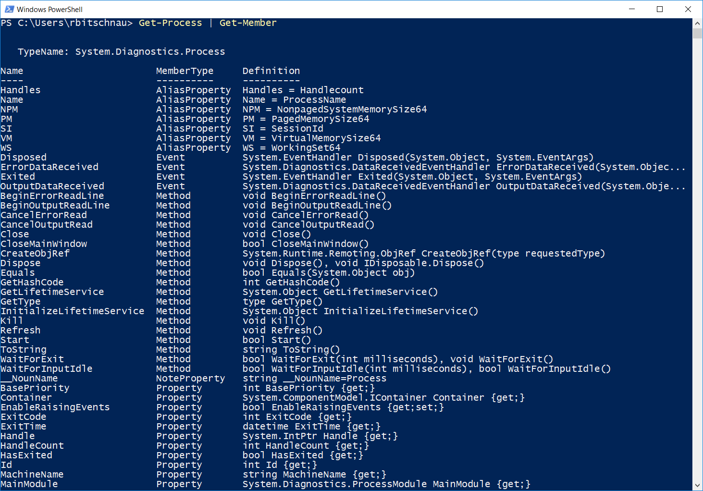

Hilfreiche Cmd-Lets
===================

Get-Help
--------

Bei Get - Help wird man hauptsächlich auf die Online Hilfe Seite von
Microsoft weitergeleitet, und es werden diverse Befehlsvorlagen gezeigt.
|image0|

Get-Command
-----------

Bei Get - Command werden alle Befehle die Powershell zu Verfügung stellt
angezeigt. |image1|

Get-Member
----------

Mit dem Cmdlet Get - Member werden die Elemente (Eigenschaften und
Methoden) von Objekten abgerufen. |image2|

Übung
-----

Finde heraus in welchem Property in einem Objekt aus der Funktion
``Get-PSDrive`` die maximale Größe eines Datenträgers steht.

Lösung
~~~~~~

.. code:: powershell

   Get-PSDrive | Get-Member

In dem Property ``MaximumSize`` steht die maximale Größe eines
Datenträgers

